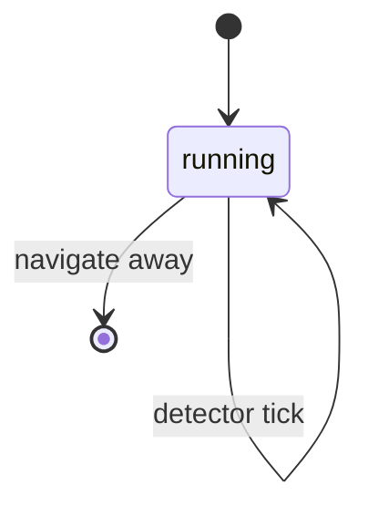
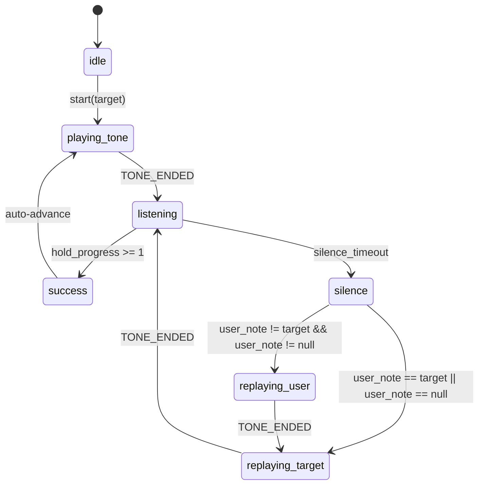
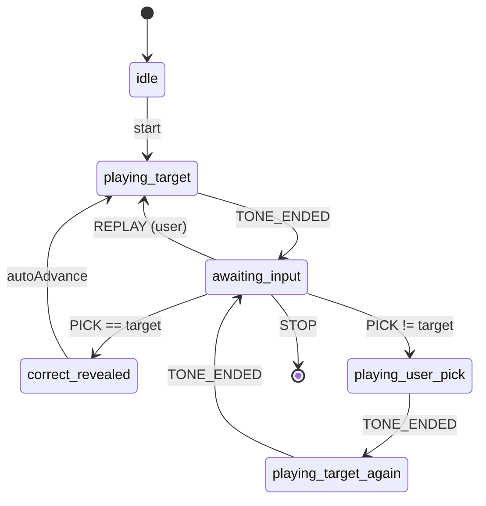

# Exercise State Machines

## Tuner

```mermaid
stateDiagram-v2
  [*] --> running
  running --> running: detector tick
  running --> [*]: navigate away
```

## Match Pitch

```mermaid
stateDiagram-v2
  [*] --> idle
  idle             --> playing_tone:     start(target)
  playing_tone     --> listening:        TONE_ENDED
  listening        --> success:          hold_progress >= 1
  listening        --> silence:          silence_timeout
  silence          --> replaying_user:   user_note != target && user_note != null
  silence          --> replaying_target: user_note == target || user_note == null
  replaying_user   --> replaying_target: TONE_ENDED
  replaying_target --> listening:        TONE_ENDED
  success          --> playing_tone:     auto-advance
```

## Identify Note

```mermaid
stateDiagram-v2
  [*] --> idle
  idle                 --> playing_target:        start
  playing_target       --> awaiting_input:        TONE_ENDED
  awaiting_input       --> correct_revealed:      PICK == target
  awaiting_input       --> playing_user_pick:     PICK != target
  awaiting_input       --> playing_target:        REPLAY (user)
  playing_user_pick    --> playing_target_again:  TONE_ENDED
  playing_target_again --> awaiting_input:        TONE_ENDED
  correct_revealed     --> playing_target:        autoAdvance
  awaiting_input       --> [*]:                   STOP
```
